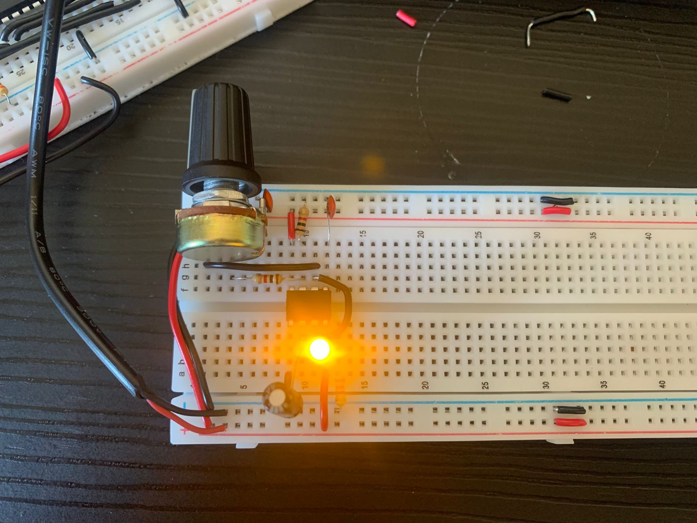
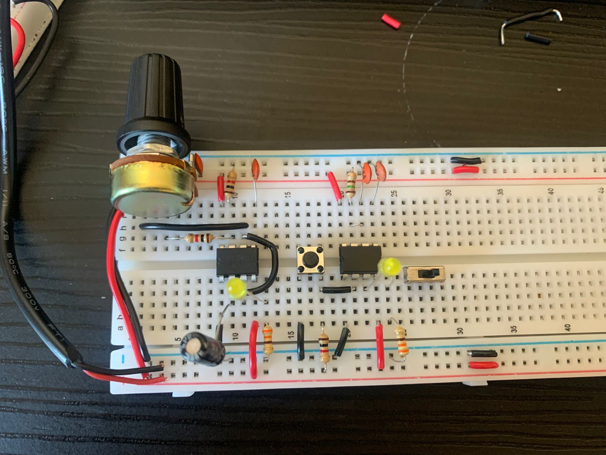
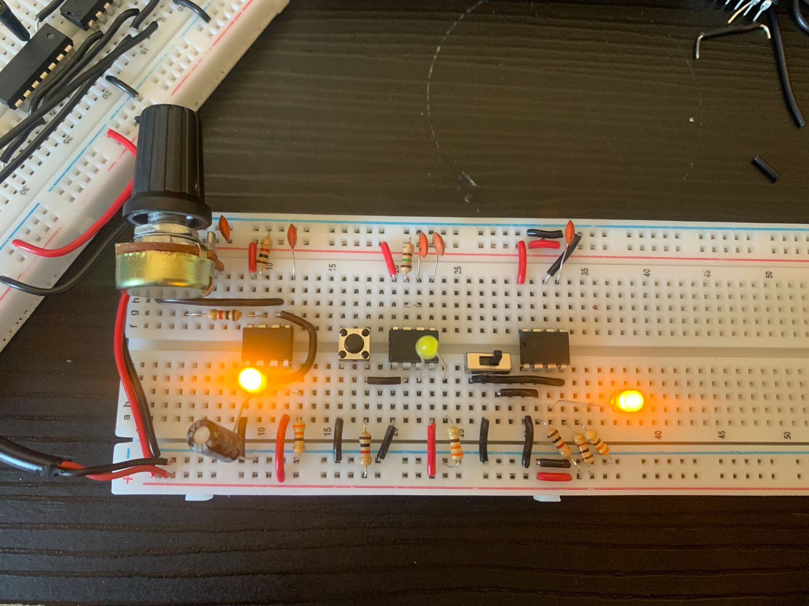
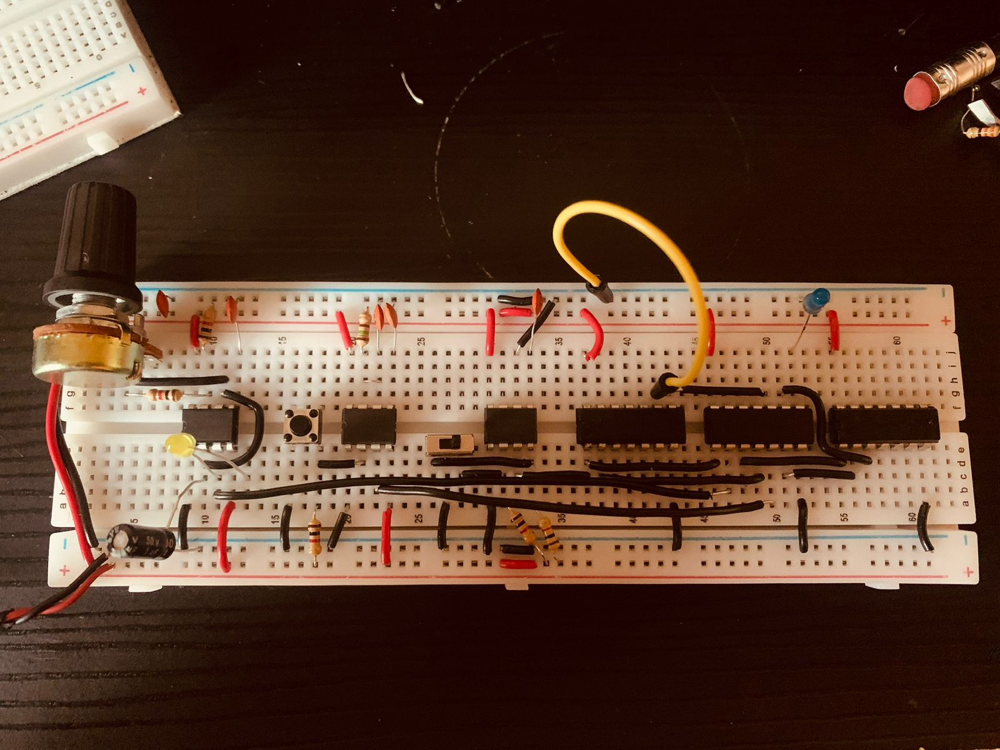

# Módulo Clock

## Parts List

* 3x NE555P (temporizadores)
* 1x 74LS08 (Quad AND gate)
* 1x 74LS04 (Hex inverter)
* 1x 74LS32 (Quad OR gate)
* 1x potenciômetro de 1MΩ
* 5x resistores 1kΩ
* 1x resistor 1.1MΩ
* 1x capacitor eletrolítico 1µF
* 4x capacitores cerâmicos 0.1µF
* 1x chave tátil
* 1x chave deslizante
* Cabo rígido 22 AWG (0,30mm)
* 1x LED azul
* 3x LED amarelos (para debug)
* 3x resistores de 330Ω (pode ser 220Ω)

## Como funciona

O módulo usa 3x NE555P, um pra cada função, seguindo o design do [Ben Eater](https://eater.net/8bit/clock) (mecânica de cada modo do 555 no [datasheet NE555](https://www.ti.com/lit/ds/symlink/[...])).

| IC  | Modo        | Função                                              |
|-----|-------------|------------------------------------------------------|
| IC1 | Astável     | Clock automático contínuo                             |
| IC2 | Monoestável | Pulso único no clique manual (step-by-step)           |
| IC3 | Biestável   | Debounce da chave que seleciona entre IC1 e IC2       |

A seleção entre clock automático e manual usa lógica combinacional: quando a chave deslizante está numa posição, o sinal do IC1 (astável) passa pelas portas AND/OR até a saída; na outra [...]

## Imagens

Primeira etapa:

Segunda etapa:

Terceira etapa:

Quarta etapa:

## Vídeos

Observação: o GitHub permite abrir os arquivos de vídeo no visualizador com player ao clicar nos links abaixo.

- Primeiro estágio (vídeo): [first-stage.mp4](../assets/first-stage.mp4)

- Quarto estágio (vídeo): [fourth-stage.mp4](../assets/fourth-stage.mp4)

## Decisões de projeto

Uma substituição em relação à lista original do Ben Eater, e por quê:

* **Resistor de 1.1MΩ no lugar de 1MΩ.** Margem de 10%, dentro da faixa aceitável pra esse RC — não muda o comportamento do circuito de forma perceptível.

## Debug

Usei o multímetro em modo de continuidade (buzzer) para testar trilha por trilha do protoboard MB-102, e identifiquei que a continuidade se interrompia na região central, comportamento padrão d[...]

Outro bug que eu descobri é que no segundo CI eu não estava realizando o pull-up adequadamente sobre o botão tátil (pino 2, trigger), então a tensão estava flutuante e não controlada. Com i[...]
